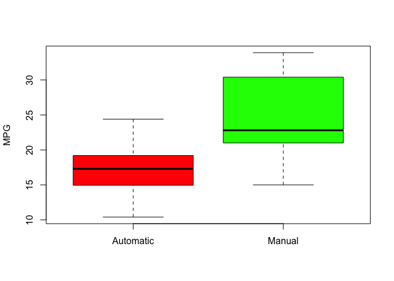
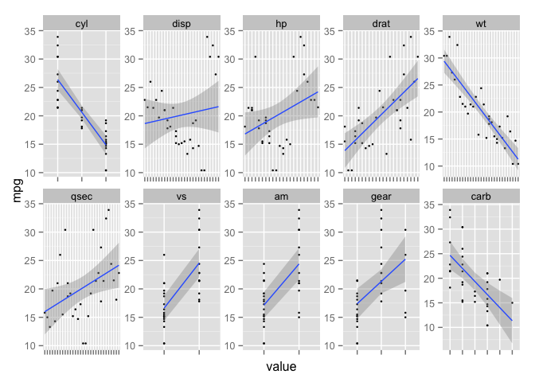
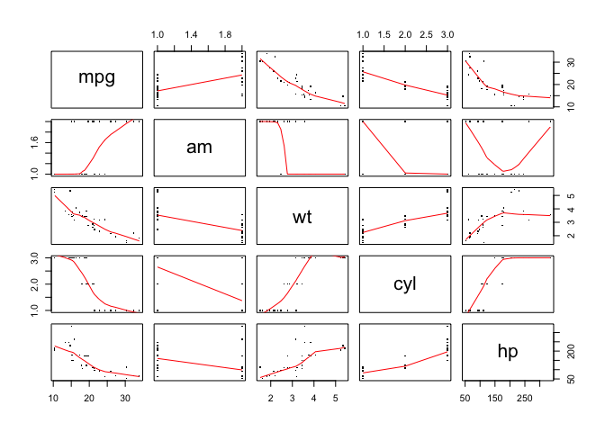
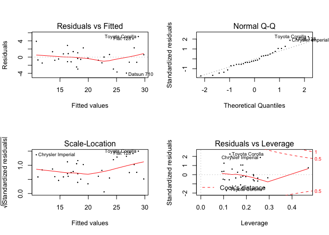

# THE IMPACT OF TRANSMISSION TYPES ON FUEL ECONOMY

## Coursera Regression Models Project   

(NOTE: The .Rmd file used to create this PDF can be found at https://github.com/yoherve/RegModsProject.git)   

#### EXECUTIVE SUMMARY
This report examines the relationship between fuel efficiencey and automobile transmission types, and specifically addresses the questions as to whether automatic or manual transmissions generate more miles per gallon (MPG) and quantifies any MPG differences. On average, with other factors held constant, cars with manual transmissions yield 1.8 more MPG than cars with automatic transmissions. Transmission type significantly impacts MPG, but a more accurate predictive model also includes vehicle weight, horsepower and number of cylinders.

#### EXPLORATORY DATA ANALYSIS
The data for this analysis comes from the **mtcars** data set which is based on a 1974 Motor Trend US magazine study and comprises fuel consumption and 10 aspects of automobile design and performance for 32 automobiles (1973-1974 model years). The **mtcars** data set contains the following variables:

* mpg - Miles/(US) gallon
* cyl - Number of cylinders
* disp - Displacement (cu. in.)
* hp - Gross horsepower
* drat - Rear axle ratio
* wt - Weight (lb/1000)
* qsec - 1/4 mile time
* vs - V/S
* am - Transmission (0 = automatic, 1 = manual)
* gear - Number of forward gears
* carb - Number of carburetors

Let's begin by converting **mtcars** variables to factors as necessary (NOTE: Choosing not to convert certain variables to factors may generate different analysis results.):


```r
data("mtcars")
mtcars$cyl <- factor(mtcars$cyl)
mtcars$vs <- factor(mtcars$vs)
mtcars$gear <- factor(mtcars$gear)
mtcars$am <- factor(mtcars$am, labels = c("Automatic", "Manual"))
mtcars$carb <- factor(mtcars$carb)
```

#### MODEL FITTING AND SELECTION

We'll use R's step() function to find the best model:


```r
all_model <- lm(mpg ~ ., data = mtcars)
step_model <- step(all_model, direction = "both")
```


```r
summary(step_model)
```

```
## 
## Call:
## lm(formula = mpg ~ cyl + hp + wt + am, data = mtcars)
## 
## Residuals:
##     Min      1Q  Median      3Q     Max 
## -3.9387 -1.2560 -0.4013  1.1253  5.0513 
## 
## Coefficients:
##             Estimate Std. Error t value Pr(>|t|)    
## (Intercept) 33.70832    2.60489  12.940 7.73e-13 ***
## cyl6        -3.03134    1.40728  -2.154  0.04068 *  
## cyl8        -2.16368    2.28425  -0.947  0.35225    
## hp          -0.03211    0.01369  -2.345  0.02693 *  
## wt          -2.49683    0.88559  -2.819  0.00908 ** 
## amManual     1.80921    1.39630   1.296  0.20646    
## ---
## Signif. codes:  0 '***' 0.001 '**' 0.01 '*' 0.05 '.' 0.1 ' ' 1
## 
## Residual standard error: 2.41 on 26 degrees of freedom
## Multiple R-squared:  0.8659,	Adjusted R-squared:  0.8401 
## F-statistic: 33.57 on 5 and 26 DF,  p-value: 1.506e-10
```

With an AIC of 61.65 and an adjusted R-squared value of .8401, the model which includes Cylinders, Horsepower, Weight and Transmission appears to be the best predictor of MPG. This model also generates a p-value of 1.506e-10, allowing us to reject the null hypothesis - the included variables do indeed significantly influence MPG rates.

Let's also check the best model from the step() function with the simple model which only includes Transmission as a predictor for MPG:


```r
simple_model <- lm(mpg ~ am, data = mtcars)
anova(simple_model, step_model)
```

```
## Analysis of Variance Table
## 
## Model 1: mpg ~ am
## Model 2: mpg ~ cyl + hp + wt + am
##   Res.Df    RSS Df Sum of Sq      F    Pr(>F)    
## 1     30 720.90                                  
## 2     26 151.03  4    569.87 24.527 1.688e-08 ***
## ---
## Signif. codes:  0 '***' 0.001 '**' 0.01 '*' 0.05 '.' 0.1 ' ' 1
```

The p-value of 1.688e-08 allows us to reject the null hypothesis - the best model generated by the step() function is significantly better than the simple model.

#### CONCLUSION

Transmission type significantly impacts MPG, but a more accurate predictive model also includes vehicle weight, horsepower and number of cylinders. Transmission type alone accounts for about 34% of variation in MPG, while the addition of weight, horsepower and cylinders increases the portion of variability accounted for to 84%.

MPG increases by 1.8 for cars with manual vs automatic transmissions.
MPG decreases by 2.5 for every one ton increase in vehicle weight.
MPG decreases by 3 and 2.2 as the number of cylinders increases from 4 to 6 to 8, respectively.
MPG decreases by a small amount as vehicle horsepower increases.

\pagebreak

#### APPENDIX

### Figure 1 - MPG by Transmission Type
   
 

---

### Figure 2 - MPG vs All Variables  


 

### Figure 3 - Pairs Plot for Variables Included in Best Model  

 

---

### Figure 4 - Residuals Plots  

 
